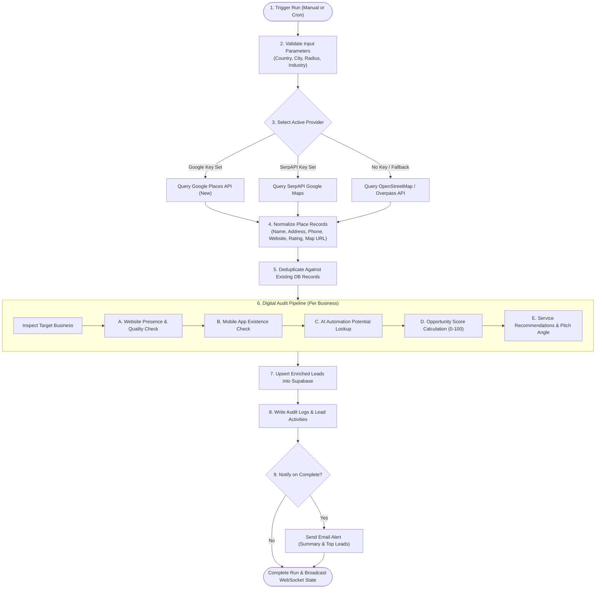

# Deliverable 3: AI Agent Discovery & Scoring Workflow

This document details the exact execution logic and scoring algorithms employed by the **Lead Discovery Agent**.

---

## 1. Step-by-Step Agent Execution Flow

---

## 2. Digital Presence Audit Specification

### A. Website Presence & Quality Check
For each business discovered:
1. **URL Validation**: If no website is listed in the directory $\rightarrow$ Set `website_status = 'no_website'`.
2. **HTTP/DNS Ping**: If a website URL exists, send an asynchronous HTTP request with a 4-second timeout:
   - **Unreachable / Dead**: HTTP 404, 500, or DNS resolution failure $\rightarrow$ Set `website_status = 'unreachable'`.
   - **Insecure / Mixed**: Plain HTTP with invalid SSL certificates $\rightarrow$ Flag for upgrade.
   - **Mobile Viewport Check**: Inspect the HTML `<meta name="viewport">` tag. If missing or fixed-width, the website is non-responsive on mobile devices.
   - **Outdated Heuristic**: Inspect the footer copyright string (e.g., `© 2014-2018`). If the copyright year is older than 3 years or uses obsolete libraries (e.g. Flash, jQuery 1.x, table-based layouts) $\rightarrow$ Set `website_status = 'outdated'`.
   - **Modern**: Valid HTTPS, mobile-responsive viewport, updated assets $\rightarrow$ Set `website_status = 'active'`.

### B. Mobile App Presence Check
1. Checks whether the business has a dedicated branded mobile app on the Apple App Store or Google Play Store.
2. Query iTunes Search API (`https://itunes.apple.com/search?term={business_name}&entity=software`) and Google Play scraper heuristics.
3. If no dedicated app matches $\rightarrow$ Set `has_app = false`.

### C. AI Automation Potential Matrix
Different local service verticals have radically different automation bottlenecks. The engine applies an industry-specific automation index ($0 - 100$):

| Industry Vertical | Automation Score | High-Value Automation Opportunities |
| :--- | :---: | :--- |
| **Dental & Healthcare Clinics** | **95** | 24/7 AI appointment booking, SMS reminder sequences, insurance intake forms, patient triage bot |
| **Restaurants & Cafes** | **90** | Direct zero-commission ordering, digital menu QR ordering, reservation management, automated review collection |
| **Salons & Spas** | **88** | Real-time stylist scheduling, deposit payments, automated no-show reduction SMS, Instagram DM booking bot |
| **Legal & Financial Services** | **85** | Client onboarding portal, AI document collection & OCR, consultation scheduling |
| **Home Services (Plumbing / HVAC / Electrician)** | **92** | Instant emergency quote bot, dispatch status SMS, photo quote evaluation |
| **Automotive & Collision** | **84** | Vehicle repair status tracker, digital inspection reports, automated maintenance reminders |
| **Fitness / Yoga / Gyms** | **80** | Class booking app, recurring membership portal, personal trainer scheduling |
| **Boutique Retail** | **75** | Inventory synchronization, click-and-collect portal, WhatsApp customer support bot |
| **General / Other** | **65** | Google Business Profile sync, automated customer inquiry response |

---

## 3. Opportunity Score Formula ($0 - 100$)

The Opportunity Score represents how prime a business is for website design, app development, client portals, and AI automations.

$$\text{Opportunity Score} = \min(100, W + A + I + R)$$

Where:
- **$W$ (Website Component - max 45 pts)**:
  - No Website: $+45\text{ pts}$
  - Outdated Website / Non-Mobile: $+25\text{ pts}$
  - Unreachable Website: $+35\text{ pts}$
  - Active Modern Website: $+0\text{ pts}$
- **$A$ (App Component - max 15 pts)**:
  - No Mobile App: $+15\text{ pts}$
  - Has Branded Mobile App: $+0\text{ pts}$
- **$I$ (Industry Automation Weight - max 25 pts)**:
  - $\frac{\text{AI Automation Potential}}{100} \times 25$
- **$R$ (Reputation & Viability - max 15 pts)**:
  - A business with 50+ Google reviews and $\ge 4.2$ rating has proven revenue and customer flow to afford your services:
    - $> 100\text{ reviews}$: $+15\text{ pts}$
    - $30 - 100\text{ reviews}$: $+10\text{ pts}$
    - $< 30\text{ reviews}$: $+5\text{ pts}$

### Opportunity Score Categorization:
- **90 - 100 (Urgent / Prime Lead)**: Established revenue, zero modern digital presence. High closing probability.
- **75 - 89 (High Opportunity)**: Outdated presence, no app, massive automation upside (e.g. appointment booking).
- **50 - 74 (Moderate Opportunity)**: Has basic website but missing client portal or modern AI automation.
- **< 50 (Low Priority)**: Already well-equipped with modern web and mobile apps.

---

## 4. Sales Pitch Generator

For each lead, the agent automatically generates:
1. **Target Opportunity Reason**: Concise explanation of the business's current digital deficiency and lost revenue.
2. **Suggested Offer Package**: 3 specific services to pitch (e.g. `['Modern Next.js Website', 'Direct Online Ordering System', 'WhatsApp AI Customer Bot']`).
