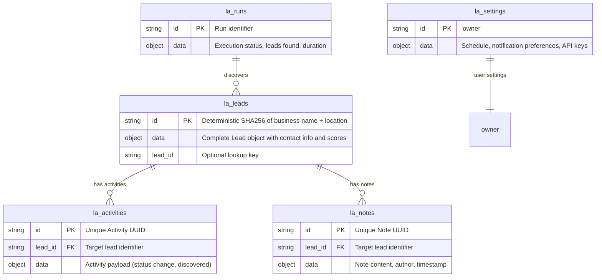

# Database Architecture: MongoDB Atlas

The **Araknet Business Lead Discovery SaaS** uses **MongoDB Atlas** (Free Tier / M0 via GitHub Student Pack) as its high-performance document database layer.

Connection is managed via the official `mongodb` driver in [`lib/mongodb.ts`](file:///c:/Users/DELL/OneDrive/Desktop/Leads%20Agent/lib/mongodb.ts) with persistence and querying handled in [`lib/storage.ts`](file:///c:/Users/DELL/OneDrive/Desktop/Leads%20Agent/lib/storage.ts).

---

## Collections Architecture

---

## Collection Schemas

### 1. `la_leads`
Stores discovered businesses, digital audit results, contact info, and pipeline status.
* `id`: Deterministic SHA-256 hash calculated from `business_name + country + city + address`. This guarantees idempotency: repeating scans in the same city will never create duplicate leads, preserving existing notes and pipeline progress.
* `data.business_name`: Business name.
* `data.country`: Country of location.
* `data.city`: City of location.
* `data.address`: Formatted address.
* `data.phone`: Contact phone number.
* `data.industry`: Category (restaurant, clinic, salon, real estate, etc.).
* `data.website_url`: Discovered website URL.
* `data.website_status`: `no_website`, `outdated`, `active`, or `unreachable`.
* `data.has_app`: Boolean indicating mobile app presence.
* `data.google_rating`: Star rating (e.g. 4.8).
* `data.google_reviews_count`: Total review count.
* `data.opportunity_score`: 0–100 composite ranking of digital sales opportunity.
* `data.suggested_services`: Recommended offerings (`Modern Website`, `Booking Portal`, `AI Voice Bot`, etc.).
* `data.lead_status`: Pipeline stage (`new`, `contacted`, `proposal_sent`, `won`, `lost`).

### 2. `la_activities`
Timeline of all events that occur on leads.
* `id`: UUID.
* `lead_id`: Associated lead ID.
* `data.activity_type`: `discovered`, `status_change`, `note_added`.
* `data.description`: Human-readable summary.
* `data.created_at`: ISO 8601 timestamp.

### 3. `la_notes`
Private CRM notes added to any lead.
* `id`: UUID.
* `lead_id`: Associated lead ID.
* `data.content`: Markdown or text note.
* `data.author`: Author name.
* `data.created_at`: ISO 8601 timestamp.

### 4. `la_runs`
Log of autonomous agent runs.
* `id`: Unique run ID.
* `data.parameters`: Search parameters (Country, City, Industry).
* `data.status`: `running`, `completed`, `failed`.
* `data.leads_found`: Count of leads discovered in this run.

### 5. `la_settings`
Dashboard configuration and automated schedules.
* `id`: `'owner'`.
* `data.schedule_enabled`: Boolean.
* `data.schedule_frequency`: `daily`, `weekly`.
* `data.notification_email`: Email recipient.
