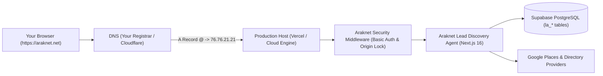

# Deploying to Your Domain: araknet.net

This guide provides the exact configuration and DNS records required to deploy the **Araknet Business Lead Discovery Agent** to your live domain: **`araknet.net`** (or subdomain **`leads.araknet.net`**).

---

## 1. Domain Architecture Overview



---

## 2. Step 1: Push Code to GitHub & Deploy to Vercel

If you haven't yet linked your GitHub repo:
1. Create a repository on GitHub (e.g. `araknet-leads` or `leads-agent`).
2. Run in your project terminal:
   ```bash
   git remote add origin https://github.com/Alihussain121472/araknet-leads.git
   git push -u origin main
   ```
3. Go to [vercel.com/new](https://vercel.com/new), select your repository, and click **Import**.

---

## 3. Step 2: Configure Environment Variables

In your Vercel Project Settings $\rightarrow$ **Environment Variables**, add:

| Variable | Description | Example / Recommended Value |
| :--- | :--- | :--- |
| `DASHBOARD_PASSWORD` | **Required**: Password to log into `araknet.net` | Choose a strong password (e.g. `Araknet2026!SecureKey`) |
| `NEXT_PUBLIC_APP_URL` | Your custom domain | `https://araknet.net` |
| `NEXT_PUBLIC_SUPABASE_URL` | Supabase Project URL | `https://your-project.supabase.co` |
| `SUPABASE_SERVICE_ROLE_KEY` | Supabase Service Role Secret Key | `ey...` |
| `CRON_SECRET` | Secret token for automated discovery cron | Random 32-character string |
| `GOOGLE_PLACES_API_KEY` | (Optional) Paid Google Places API key | `AIza...` |
| `SERPAPI_API_KEY` | (Optional) SerpAPI key | `...` |

---

## 4. Step 3: Connect Domain `araknet.net` in Vercel

1. In your Vercel Project Dashboard, navigate to **Settings** $\rightarrow$ **Domains**.
2. Click **Add Domain**.
3. Type: **`araknet.net`** (and check "Add `www.araknet.net` as well").
   *(Or if you prefer a dedicated subdomain, type: **`leads.araknet.net`**)*.

---

## 5. Step 4: Add DNS Records in Your Domain Registrar

Log in to wherever you purchased or manage **`araknet.net`** (e.g. Cloudflare, Namecheap, GoDaddy, Hostinger, Google Domains) and go to **DNS Management**:

### Option A: Root Domain (`araknet.net`)
| Type | Name / Host | Value / Target | TTL |
| :--- | :--- | :--- | :--- |
| **A** | `@` | `76.76.21.21` | Automatic / 300 |
| **CNAME** | `www` | `cname.vercel-dns.com` | Automatic / 300 |

### Option B: Subdomain (`leads.araknet.net`)
| Type | Name / Host | Value / Target | TTL |
| :--- | :--- | :--- | :--- |
| **CNAME** | `leads` | `cname.vercel-dns.com` | Automatic / 300 |

*(Note: If using Cloudflare DNS, set the Proxy status to **DNS only** initially until the SSL certificate issues, then you can turn Proxy orange on).*

---

## 6. Step 5: Initialize Database Schema (Supabase)

1. Open your [Supabase SQL Editor](https://supabase.com/dashboard/project/_/sql).
2. Copy and paste the contents of [`supabase/production.sql`](../supabase/production.sql).
3. Click **Run**.
4. This creates the production tables: `la_leads`, `la_runs`, `la_notes`, `la_activities`, and `la_settings` protected by Row Level Security.

---

## 7. Accessing Your Deployed Agent

Once DNS propagates (usually 2-5 minutes):
1. Navigate to: **`https://araknet.net`** (or `https://leads.araknet.net`).
2. A browser authentication prompt will appear:
   - **Username**: `owner`
   - **Password**: *The `DASHBOARD_PASSWORD` you set in Step 2*.
3. Your Araknet Lead Discovery SaaS Dashboard will load live!
