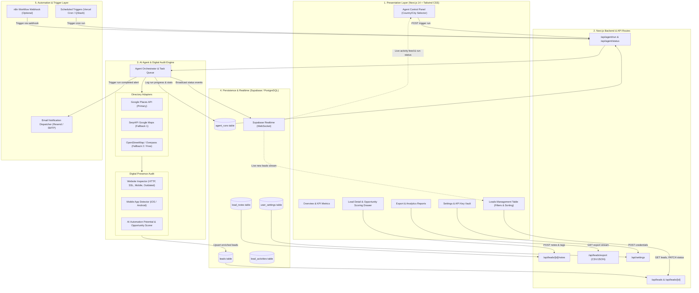
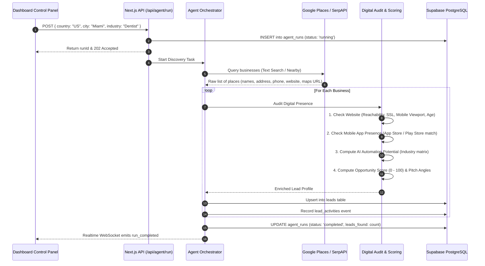

# Deliverable 1: System Architecture Diagram

This document details the high-level and component architecture for the **Business Lead Discovery SaaS Dashboard**, illustrating how the AI Discovery Agent, external business directory APIs, digital audit scanners, Supabase database, and Next.js 14 frontend interact seamlessly.

---

## 1. High-Level System Architecture

---

## 2. Component Breakdown & Responsibilities

### 2.1 Presentation Layer (Next.js 14 App Router)
- **Framework**: Next.js 14 with TypeScript and Tailwind CSS.
- **State & Data Fetching**: SWR / TanStack React Query for cached client fetching and real-time syncing.
- **UI Components**: Modern shadcn/ui aesthetic using Lucide React icons, responsive cards, slide-over modals, and searchable command-palette dropdowns for Country and City selection.
- **Realtime Listener**: Subscribes directly to Supabase Realtime PostgreSQL changes on `leads` and `agent_runs` to provide a live-updating activity log and progress indicator.

### 2.2 API Layer (Next.js Serverless Route Handlers)
- **`/api/agent/run`**: Accepts target parameters (`country`, `city`, `industry`, `maxResults`), initializes an `agent_runs` record with status `running`, and invokes the discovery engine asynchronously.
- **`/api/agent/status`**: Returns the active run status, live logs, progress percentage, and lead counters.
- **`/api/leads`**: Provides paginated, searchable, multi-faceted filtering (by Country, City, Industry, Website status, App status, Opportunity Score, and Lead status).
- **`/api/leads/[id]`**: Single lead management endpoint for status transitions (`new` $\rightarrow$ `contacted` $\rightarrow$ `proposal_sent` $\rightarrow$ `won` $\rightarrow$ `lost`) and tag assignments.
- **`/api/leads/export`**: Generates RFC 4180 compliant CSV downloads or formatted JSON based on currently active filters.

### 2.3 AI Agent & Digital Audit Pipeline
The core intelligence engine operates as a sequential 4-stage pipeline:

### 2.4 Data & Persistence Layer (Supabase / PostgreSQL)
- **PostgreSQL Database**: Relational model with foreign keys, index optimization on `city`, `country`, `industry`, `opportunity_score`, and `status`.
- **Realtime Engine**: Pushes Postgres write events (`INSERT`, `UPDATE`) to connected frontend clients over WebSockets without requiring frequent polling.
- **Row Level Security (RLS)**: Protects leads, notes, and credentials per authenticated user or single-tenant admin key.

### 2.5 Scheduling & Alert Layer
- **Vercel Cron / QStash**: Dispatches scheduled HTTP calls to `/api/agent/run` using an authorized Bearer token on daily or weekly intervals.
- **Email Notifications**: Triggers transactional completion emails (via Resend or SMTP) containing a summary of high-opportunity leads found during the run.

---

## 3. Data Flow Specification

| Step | Component | Data Transferred | Destination |
| :--- | :--- | :--- | :--- |
| **1. Trigger** | Dashboard UI | `{ country, city, industry, schedule }` | `/api/agent/run` |
| **2. Search** | Directory Adapter | Geocoded query `"{industry} in {city}, {country}"` | Google Places / SerpAPI / OSM |
| **3. Audit** | Audit Worker | HTTP HEAD/GET, DNS resolve, Viewport header | Target business domain (if exists) |
| **4. Score** | Scoring Engine | Industry matrix + Digital Audit flags | Opportunity Score ($0 - 100$) + Reason Breakdown |
| **5. Store** | Agent Orchestrator | Normalized Enriched Lead Record | Supabase `leads` & `agent_runs` |
| **6. Stream** | Supabase Realtime | New Record Payload | Dashboard UI live feeds |
| **7. Export** | Export API | Filtered Lead Dataset | RFC 4180 CSV / PDF report |
